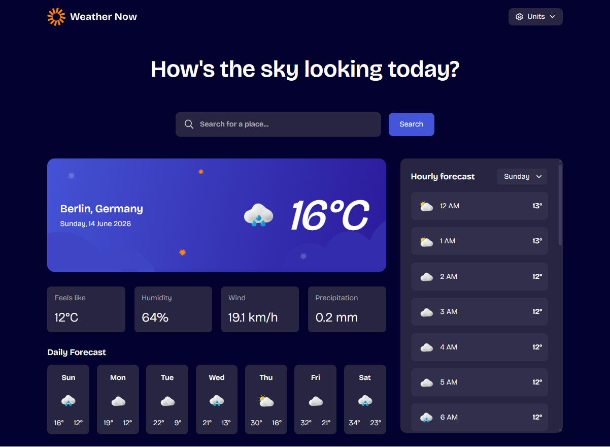

# Frontend Mentor - Weather App Solution

This is my solution to the [Weather App Challenge](https://www.frontendmentor.io/challenges/weather-app-K1FhddVm49) on Frontend Mentor. 

---

## Overview

### The Challenge

Users should be able to:

- Search for weather information by entering a location in the search bar
- View current weather conditions including temperature, weather icon, and location details
- See additional weather metrics like "feels like" temperature, humidity percentage, wind speed, and precipitation amounts
- Browse a 7-day weather forecast with daily high/low temperatures and weather icons
- View an hourly forecast showing temperature changes throughout the day
- Switch between different days of the week using the day selector in the hourly forecast section
- Toggle between Imperial and Metric measurement units via the units dropdown 
- Switch between specific temperature units (Celsius and Fahrenheit) and measurement units for wind speed (km/h and mph) and precipitation (millimeters) via the units dropdown
- View the optimal layout for the interface depending on their device's screen size
- See hover and focus states for all interactive elements on the page

---

## Screenshot

---

## Links

- Solution URL: [Add your Frontend Mentor solution URL here]()
- Live Site URL: https://leoidk21.github.io/Weather-App/

---

## Built With

- React + Vite
- Responsive Design
- CSS Custom Properties & Flexbox/Grid layout

---

## Features

- View the current weather for the selected city
- View extra weather details like feels-like temperature, humidity, wind, and precipitation
- See weather suggestions while typing.
- View a 7-day daily forecast
- View an hourly forecast for a selected day
- Switch between metric and imperial units.
- See loading, no-result, and API error states.

---

## What I Learned

While building this project, I improved my understanding of:

- API handling using Open-Meteo Geocoding and Forecast APIs

---

## Author

- GitHub: https://github.com/leoidk21
- Frontend Mentor: https://www.frontendmentor.io/profile/leoidk21

